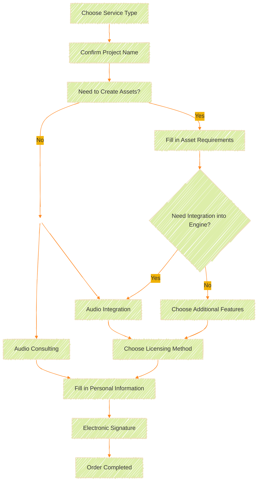

## **Self-Service Quotation System**

To help customers and users understand the cost of custom sound production, we provide an online estimation form.  
First, click on the `Get Quote` button in the top-left corner.

<ImageCard
  image="/Images/services/Choose-01.png"
/>

## **Overview of the Process**

The following diagram provides an overview of the entire service process.

## **Choose Service Type**

On this screen, you can select the type of service. Currently, there are six options:

<ImageCard
  image="/Images/services/QuoteType.jpg"
/>

<CardGrid>
  <LinkCard title="Sound Design" href="/Service/vgyyszs8/" description="Sound Design"/>

  <LinkCard title="Music Production" href="/" description="Music Production"/>

  <LinkCard title="Voice Recording" href="/" description="Voice Recording"/>

  <LinkCard title="Game Integration" href="/" description="Game Integration"/>

  <LinkCard title="Audio Consulting" href="/" description="Audio Consulting"/>

  <LinkCard title="Holistic Planning" href="/" description="Project Management"/>

</CardGrid>

## **Confirm Project Name**
 
On this page, you can confirm your previous selection and decide on your project name.
<ImageCard
  image="/Images/services/Choose.jpg"
/>
You can also select multiple services on this page.  
For example: Select both sound effects + integration.

<ImageCard
  image="/Images/services/MultiChoose.jpg"
/>

::: warning
If you only need asset creation, do not select "Integration."
:::

::: tip Guide
Example:

If you need 17 sound effects, 2 pieces of music, and integration into your project for assistance, select **Sound Design**{.caution} + **Music Production**{.warning} + **Game Integration**.
:::

## **Choose Additional Features**

Next, proceed to the second section, `Choose Additional Features`, where you can select whether to add extra features.

<ImageCard
  image="/Images/services/Quote-Integration-0.png"
/>

### **No Additional Features**

If your commission only requires asset creation, select this option.

### **Issue a License**

If you need a license document to certify that the commissioned files are directly provided by "Sound Jaeger" and guarantee their legal use, select this option.  
Ex: In some cases, such as government agencies, you may need to verify the legality of your assets or media files. Issuing a license can effectively resolve this issue.

### **Extend Warranty Period**

The warranty and modification period for all commissioned productions is two weeks (14 days) after file delivery. If you need to extend this period, you can do so here.

### **Game Engine Integration**

This option can be used as an **independent** or **additional** feature for your commission.

<ImageCard
  image="/Images/services/Quote-Integration-1.png"
/>

The top three sections of this page are as follows:

::: steps
1. **Select Your Current Audio Engine**
   
    Currently, we offer four integration methods:
    - `FMOD`
    - `Wwise`
    - `Unity`
    - `Unreal`
    
    Please let us know which audio engine your game is currently using.  
    If you haven't used one before, feel free to discuss suitable solutions with us.

2. **First Time Using Audio Integration Services**
  
    If this is your first time using this service and you haven't set up any related audio engine systems before, select **`Yes`**. A basic setup fee will be charged for the first time.
    
    If you've used this service before or already have an installed and functioning audio engine, select **`No`**.

3. **Your Project Scale**

    Let us know the scale of your project. We offer different pricing for various development scales.  
    If you are a student or independent developer, select `Small Indie Game`.  
    If you are a regular game development company or studio, select `Non-Indie Game`.  
    If you are a company developing AAA games or online games, select `AAA Scale Game`.

4. **Your Project Asset Quantity**
   
   Note that the quantity here is **not directly related**{.warning} to the number of assets you are commissioning. Fill in the correct number of assets you need integrated into your current game.
    <ImageCard image="/Images/services/Quote-Integration-2.png"/>
    
    
    **Sound Effect Attributes**  
    After filling in the asset quantity, remember to complete the settings for the attributes on the right.  
    Select whether your game project is **`2D`** or **`3D`**, as this will affect the production process.  
    **Music Attributes**  
    If you need to create music events with "logic," select the corresponding option.  
    **Voice Attributes**  
    Confirm whether your project requires multi-language functionality in this field.
    ::: warning
    For example, if you are commissioning 5 sound effects, 2 pieces of music, and your game already has 21 sound effects, 3 pieces of music, and 10 voice lines, and you want all sounds integrated into the audio engine, fill in 26 sound effects, 5 pieces of music, and 10 voice lines.
    :::

5. **Integration Price Estimate**

    The price below will show the cost for the "Integration" part (this stage is unrelated to the cost of commissioned production).
:::

::: tip
When selecting service types, if you choose **Game Integration**, this section will appear independently. You can also call it out separately in the `Choose Additional Features` options.
:::

## **Choose Licensing Method**

To ensure originality and protection, all commissioned productions include licensing fees.  
For details on different licensing modes, refer to our [License Policy](https://portal.soundjaeger.com/license-policy/).

<ImageCard image="/Images/services/License Fee.png"/>

### **Single Project License**  
The commissioned sound can only be used for a single project. You **cannot**{.caution} use the commissioned files or assets for content outside of the project.  

### **Multi-Project License**   
The commissioned sound can be used for multiple projects. You **can**{.green} use the commissioned files or assets for an unlimited number of projects. 

### **Buyout License**  
You own all rights to the commissioned sound, including but not limited to:  
✅ Copyright  
✅ Moral Rights   
✅ Permanent Usage Rights  
✅ Secondary Modification Rights

::: important
If you need a written license agreement, please contact us. We provide physical or electronic contracts for mutual protection.
:::
::: caution 
All licensing methods, except for **Buyout License**, prohibit providing the assets to more than one person simultaneously.
:::

### **Cost Calculation**

After completing all the forms above, the **blue box** shows the cost for `commissioned assets`, while the **green box** shows the cost for `integration and additional features`.  
Click **`Next`** to proceed to the next page for confirmation.

## **Confirm Order Details**

On the second page, you can check the content from the previous page for errors. If corrections are needed, click **`Previous`** to go back and modify. If everything is correct, click **`Next`** to proceed to the personal information page.
<ImageCard image="/Images/services/Check-Your-Quote.png"/>

## **Fill in Personal Information**

Next, provide your personal information. If you've filled it out before, you can select it from `Load Personal Data`, and the system will automatically populate your previous information.
<ImageCard image="/Images/services/Personal-Data.png"/>

::: important
If you are an individual or an independent studio, select **`Individual`**. If you are a company or have a business registration number, select **`Corporate`**. This will affect the invoice and quotation header.  
:::

## **Electronic Signature**

This is the final step. To ensure the order is valid, you need to provide an electronic signature as the sole legal basis for the quotation order.  
If you are not yet sure about the order's accuracy, you can choose **None** at this step and sign later after confirming.

### **None**
<ImageCard image="/Images/services/Sign-File-01.png"/>

If you choose this option, the order will be saved and will only take effect after you sign it.

### **Handwritten Signature**
<ImageCard image="/Images/services/Sign-File-02.png"/>

If you are the direct person in charge of the order, you can sign directly on the screen. The order will take effect upon submission of the signature.

### **Upload Stamp**
<ImageCard image="/Images/services/Sign-File-03.png"/>

If you are a corporate entity and not the direct point of contact, you can upload your company's stamp image instead.