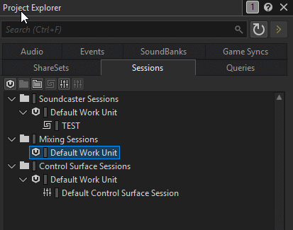
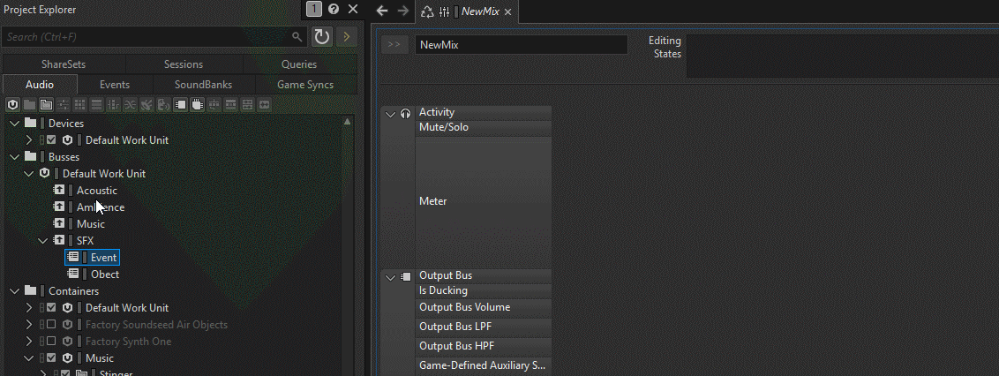
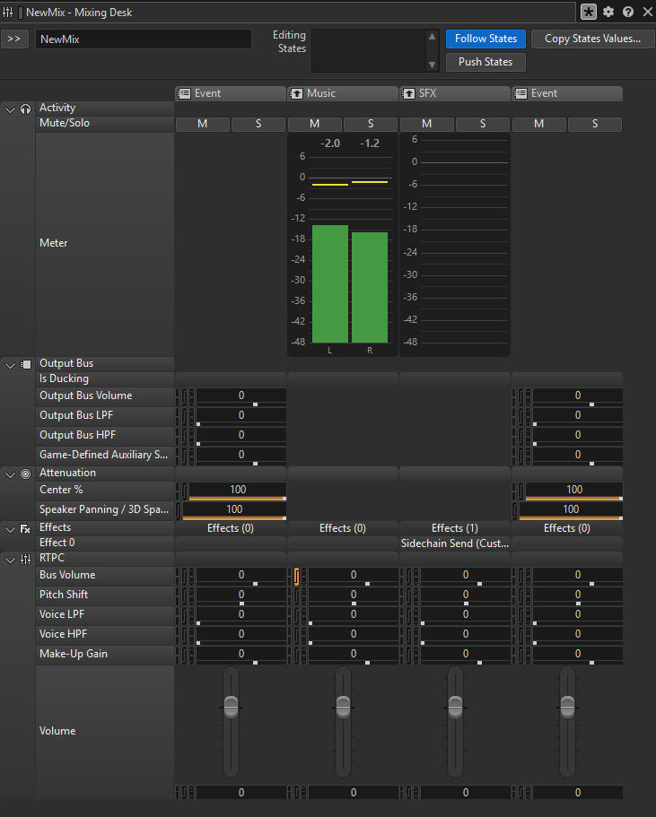

::: important 前情提要
在本章節中，我們將深入探討Wwise的Sessions選項卡。Sessions選項卡是Wwise Project Explorer中的一個重要組成部分，主要用於管理和監控音頻會話。通過這個選項卡，使用者可以查看當前的音頻會話狀態、參與的音頻對象以及相關的屬性和設置。
:::

## **Sessions選項卡介紹**

Sessions選項卡的界面主要由以下幾個部分組成：

::: steps
1. `Soundcaster Sessions`：顯示當前所有的音頻會話，使用者可以選擇不同的會話進行查看和管理。
2. `Mixing Sessions`：顯示與混音相關的會話，允許使用者監控和調整混音設置。
3. `Control Surface Sessions`：顯示控制表面相關的會話，方便使用者進行實時控制和調整。

## Soundcaster Sessions

Soundcaster的功能是讓設計師可以在Wwise中模擬音頻事件的行為，如果沒有Soundcaster協助的話，聲音設計師就很難在開發過程中同時測試多種音效的交互和聯動效果。

### 新增一個Session
首先我們先在`Soundcaster`選項卡中新增一個Session:

我們已經成功了新增了一個`Soundcaster Session`，接下來我們可以在這個Session中新增音效事件來進行測試。

### 添加音效到Soundcaster Desk
我們可以直接將音效事件從Project Explorer拖曳到`Soundcaster Desk`中:

### 界面上的參數

我們將音效事件拖曳到`Soundcaster Desk`後，可以看到原本參數的界面上多出了許多參數，可以讓我們更只管地控制和測試音效事件的行為。

在紅色框區域中會有四個參數，分別是：`States`、`Switches`、`RTPCs`、`Triggers`，這些參數可以讓我們在測試音效事件時模擬遊戲中的不同狀態和條件。

::: tip 怎麼查看所有參數？
在參數的區域中只會顯示==目前和事件相關的參數=={.important}，如果要查看所有的參數，可以點擊上方的「Show All」按鈕。
:::

## Mixing Sessions

`Mixing Sessions`主要用於監控和調整混音設置，讓使用者可以在Wwise中實時控制音頻的混音效果。

### 新增一個Session

### 拖拉Bus到Mixing Desk

如果和`Soundcaster Session`一樣，我們也可以將Audio Bus從Project Explorer拖曳到`Mixing Session`中:

### Mixing desk

我們可以在`Mixing Session`中看到我們每個Bus的音量，以及其他的混音參數，就像是在DAW軟體中的混音台一樣，我們可以新建無數個適合不同場景的Mixing Session。

::: info 沒有找到想調整的參數？

沒關係，我們可以點擊上方的「Mixing Desk Options」按鈕來選擇我們想要顯示的參數:

<ArtPlayer
  src="https://soundjaeger.com/Wwise_Video/Sessions/008_MixingOptions.mp4"
  fullscreen
  playbackRate
  setting
  aspectRatio
  pip
  />
:::

## Control Surface Sessions

在Wwise中，我們除了用滑鼠和鍵盤來控制Wwise的參數和設定之外，我們還可以透過MIDI控制器來控制Wwise中的參數，這就是`Control Surface Sessions`的主要功能。
甚至我們還可以使用手機或是平板電腦來當作MIDI控制器，大大的提升了我們在使用Wwise時的便利性。

### 先將MIDI控制器連接到Wwise

第一步就是先準備好你的MIDI控制器，並將它連接到你的電腦上，確保Wwise可以識別到這個MIDI設備。無論是有線還是無線的MIDI控制器都可以使用。

### 在Wwise中和MIDI設備連線

我們首先要在Wwise的設定`Project`>`Control Surfaces Devices`中新增一個MIDI設備:

<ArtPlayer
  src="https://soundjaeger.com/Wwise_Video/Sessions/009_ControlDevices.mp4"
  fullscreen
  playbackRate
  setting
  aspectRatio
  pip
  />

如果Wwise能成功辨識到你的設備，Status就會顯示為`Connected`。

::: important 注意事項
在使用MIDI控制器時，請確保控制器已正確連接並配置，如果你的設備是Ipad或是手機，請確保你的電腦和設備在同一個網路下，並透過相應的App來進行連接。
如果你使用的是TouchOSC來當作MIDI控制器，你可以使用RTPmidi來和你的無線設備進行連接。
:::

### 將設備按鈕映射到Wwise中

記得點擊按鈕啓用此設備，接下來我們才能將MIDI控制器和Wwise進行映射。
在這邊我用Ipad的MIDI DESIGNER App來做示範。

當我們啓用了設備，按鈕會變成藍色。接下來我們就可以開始做映射的動作了。
如果你不清楚具體如何操作，我也錄下了映射的過程！

<ArtPlayer
  src="https://soundjaeger.com/Wwise_Video/Sessions/011_Mapping.mp4"
  fullscreen
  playbackRate
  setting
  aspectRatio
  pip
  />

::: tip 怎麽知道映射成功了？
如果你看到Controll Assignment欄位中顯示了你的設備名稱+控制器的MIDI訊號，就代表映射成功了。
:::

### 透過TouchOSC來控制Wwise

我們已經在上個環節成功連接了MIDI控制器，接下來我們可以看看TouchOSC是如何來控制Wwise中的參數的。

<ArtPlayer
  src="https://soundjaeger.com/Wwise_Video/Sessions/010_TouchOSC.mp4"
  fullscreen
  playbackRate
  setting
  aspectRatio
  pip
  />

在這個環節，我們先點選`Learn`，等待圖標變成緑色之後，我們這時只要在TouchOSC上操作我們想要映射的按鈕或旋鈕，Wwise就會自動將這個參數映射到`Binding`的項目中。

### 三個群組分別功能？

我們可以在`Control Surface Sessions`中看到`Global`、`Current Selection`、`View Group`這三個群組選項，然而，這三個選項分別代表不同的控制範圍：

::: table full-width hl-rows="important:1"
| 名稱                | 說明                                                         |
| ------------------- | ------------------------------------------------------------ |
| `Global`            | 控制全局的對象。                                             |
| `Current Selection` | 控制當前選中的對象。                                         |
| `View Group`        | 控制特定的參數群組，這些群組可以根據使用者的需求進行自定義。 |

### View Group的使用方式

我們可以在`View Groups`中新增一個我們想要控制的群組，然後設定群組中想要控制的子對象，並將子對象按照index的順序排列，我們就能快速的透過MIDI控制器來依序控制這些子對象。

<ArtPlayer
  src="https://soundjaeger.com/Wwise_Video/Sessions/012_ViewGroups.mp4"
  fullscreen
  playbackRate
  setting
  aspectRatio
  pip
  />

## 🚀 下一步預告

看來Sessions選項卡的功能非常強大且多樣化！我們已經瞭解了Soundcaster Sessions、Mixing Sessions和Control Surface Sessions的基本結構和功能。接下來，我們將進一步探索Wwise中的其他的選項卡。

