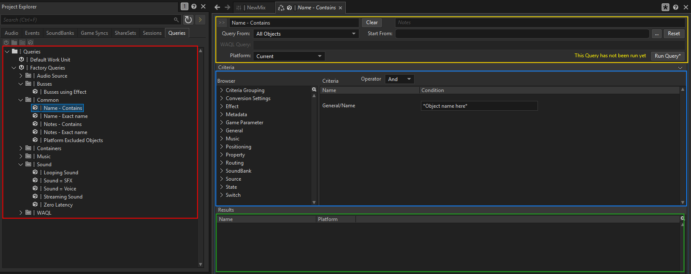
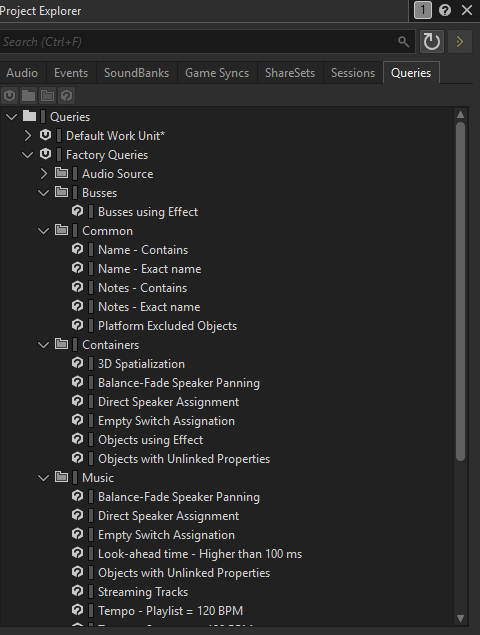
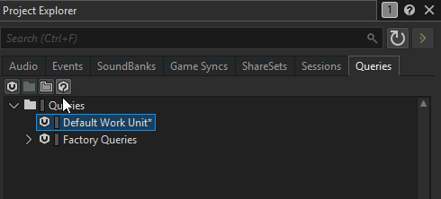

::: important 前情提要
專案的素材和設定會隨著專案的成長而不斷增加，光是Play_Event就可能有數百數千個。雖然我們可以在Project Explorer中的搜尋欄位來查找，但當我們需要更複雜的查詢時，這種方法就顯得不夠靈活。
:::

## **Queries選項卡介紹**

Queries選項卡提供了一個強大的工具，讓我們能夠建立和管理複雜的查詢，以便更有效地搜尋和篩選專案中的素材和設定。這對於大型專案特別有用，因為它可以幫助我們快速找到所需的元素。

從圖上來看大致可以分成4個區塊：

::: table hl-cells="danger:(2,1)(2,2);warning:(3,1)(3,2);blue:(4,1)(4,2);success:(5,1)(5,2)"
| 區域顏色 | 功能說明                                           |
| :------: | :------------------------------------------------- |
| **紅色** | 查詢預設和管理，裡面可以直接使用官方的預設搜尋條件 |
| **黃色** | 查詢位置和平臺。                                   |
| **藍色** | 查詢物件屬性和條件設定                             |
| **綠色** | 查詢結果顯示                                       |
:::

## **建立和使用Queries**

官方已經提供了許多預設的Queries，我們可以直接點擊並且使用這些預設的Queries來搜尋。

不過，現階段為了方便理解，我們在這邊自行透過以下步驟來建立和使用Queries：

我們可以自己創建一個想要搜尋的條件，並且將這個條件儲存起來，方便以後重複查詢。
以下影片中，我們建立了一個Query From `All Objects`、Start From `/` （全部位置），平臺設置為 `All Platforms`，並且加入了兩個條件：

- 條件一：`General` > `Sound Type` = `Sound SFX`
- 條件二：`Property` > `Value` = `3D Spatialization` + `Position`

<ArtPlayer
    src="https://r2.soundjaeger.com/Wwise_Video/Query/003_RunQueries.mp4"
    fullscreen
    playbackRate
    setting
    aspectRatio
    pip
/>

這樣就完成了一個自訂的Queries，儲存之後，以後我們就可以直接使用這個Queries來快速搜尋符合條件的素材。

## 🚀 下一步預告

大功告成！我們已經完全掌握了Project Explorer的七大選項卡功能。接下來，我們要準備進入更深一層的Wwise專案管理技巧，敬請期待下一章節！

