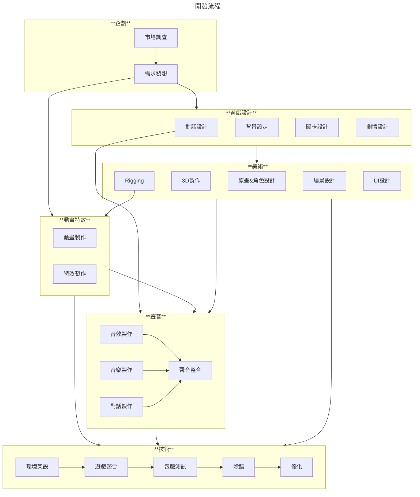

::: note 簡介
想像一下，你的遊戲世界裡，風吹樹葉沙沙作響、子彈呼嘯而過、角色情緒透過聲音表達，這些都是 FMOD 可以做到的！FMOD 就像一位音訊魔法師，讓聲音在你的遊戲中活起來。
:::

## 什麽是 ==**聲音引擎?**==

在遊戲開發中，聲音引擎是一個專門用於處理遊戲中音訊的軟體系統。

它的主要功能包括：
- [x] 播放各種音效和背景音樂。
- [x] 管理聲音的空間定位，模擬聲音的遠近、方向等。
- [x] 實現聲音的動態變化，例如根據遊戲事件調整音量、音調等。
- [x] 優化音訊播放，提高遊戲效能。
- [x] 知名的遊戲聲音引擎包括 FMOD 和 Wwise等。

## **為什麽要有聲音引擎？**

很多讀者覺得好奇，常見的遊戲引擎內已經整合了聲音播放的功能，也自帶了非常多的效果和插件，為什麽還需要另外安裝一個聲音引擎作為輔助呢？

我們可以從遊戲開發的過程來側面描述這個問題。



如果我們直接從聲音的部分開始看的話，可以拆成以下幾個步驟：


:::: steps
1.  **需求討論**

    在專案初期，遊戲設計或企劃會勾勒出整個專案的方向和規格，一開始的討論會決定接下來會用到什麽樣的聲音素材與技術細節。

2. **聲音取材和素材準備**

    聲音設計部門開始針對需要的場景、角色、動畫或特效等籌備需要的素材和製作軟件。

3. **進行素材製作**
    通常需求大致可以分成以下三類：
   - 語音、角色人聲録製
   - 音效、特效音製作
   - 音樂、背景音製作
    在素材製作的過程中，將所有檔案以WAV或OGG的格式輸出至專案內並統一管理。
4. **交付技術整合至專案**

    素材進入專案後，告知技術檔案的路徑和檔名，透過需求的規格文件來決定如何播放這些聲音。
::::

## **事情往往沒那麽簡單**

素材做完了丟給技術去接進引擎，剩下就沒什麽事了...吧？  
等等，你還沒告訴技術怎麽串接這些聲音呢。

:::details 理想中的聲音製作流程
---
```flow
st=>inputoutput: 素材製作
op=>operation: 放進專案
e=>end: 聽到聲音
st(right)->op(right)->e
```
:::

現實中我們遇到的情況是這樣：

<!-- :::details 實際要面對的情況 -->
---
```flow:vue
st=>inputoutput: 聲音素材製作
logic=>condition: 是否需要播放邏輯
event=>subroutine: 設計聲音事件
e=>end: 聽到聲音
st(right)->logic(yes)->event
st(right)->logic(no)->e

```
<!-- ::: -->
### **永遠不夠的開發時程**

> 聲音的製作往往是所有專案開發裏面的靠後的一個環節，如果在專案開發時程不長的情況下，非常容易被壓縮。

身為遊戲相關從業人員都知道：時程過於緊湊，很有可能導致專案品質!!大爆死xD!!。

正因為聲音製作的環節往往受制於美術素材和背景設定，一旦壓縮了工作時間，
不僅會讓聲音在製作過程中品質大打折扣，專案中有很多聽覺表現將會收到大幅度的影響。

:::tip 所以...該怎麽辦？
*儘可能的縮短聲音素材進入專案到播放出來的時間。*

在時程非常緊湊且不足的情況下，技術人員勢必得==刪減美術部分的整合工作=={.caution}，進而導致
 **聲音設計師** 製作完的素材很有可能無法接入遊戲內，無法達到心目中想要的表現效果。
:::

### **不知道彼此要什麽**

作為一個優秀的聲音製作人員，清楚==企劃要什麽==是極為重要的。
通常在企劃前期階段，聲音製作人就需要和遊戲設計人員盡早開始溝通，瞭解開發的專案整體的美術風格、劇情走向和競品參考，會對接下來的製作訂下更明確的方向。

:::: card-grid
::: card title="與企劃溝通要點" icon="twemoji:artist-light-skin-tone"
在專案的初期，無論是背景故事、作品受眾和開發動機都是必要的訊息，因此除了要瞭解以上幾個項目，可以明確和企劃或遊戲設計部門提出以下問題：
- **What** 這個作品需要什麽內容？
- **Who** 這個作品需要給誰觀看？
- **When** 作品的開發週期有多長？
- **where** 作品可能會放在什麽平臺？
- **Why** 這個作品的開發動機是什麽？
:::

::: card title="與技術溝通要點" icon="twemoji:technologist"
在專案執行的後期，聲音需要和技術做大量的對接與整合的工作，所以知道如何讓技術知道“如何”播放我們設計出來的聲音，便是首要的任務。
- **How** 如何播放這些聲音？
- **When** 這些聲音需要何時被播放？
- **Where** 這些聲音需要播放在哪裏？
:::
::::

:::tip 兩者的區別？
**和遊戲設計、企劃溝通最重要的事找到 ==為什麽==**。

**和程式、技術溝通最重要的部分是知道 ==如何做==**。
:::

:::warning 為何常常做出來跟預期總是不太符合？
很大的原因會在於 **企劃方面** 是否給出了明確的風格參考和專案開發方向。
若是無法在需求的說明上給出完整的規劃，很容易在後期得到不服預期的結果。
:::

### **缺乏實作靈活性**

有時候我們想要設計一些比較複雜的事件，
例如我們收到企劃方面要求如下:

:::note 設計需求
玩家在血量較低的時候，會出現心跳加快的聲音，並且伴隨喘氣聲，
同時背景音樂由舒緩轉變成緊張的氛圍。
:::

以上的事件單純透過內建的引擎，不僅實現上需要技術的協助，還要等到功能完成才有辦法進行測試。
等到測試完成，通常會耗費大量的時間在等待上。

**我們可以看看聲音引擎的介入可以改變什麽**：
::::card-grid
::: card title="單純使用內建引擎" icon="twemoji:video-game"
 - [x] 播放聲音事件
 - [x] 調控聲音音量
 - [x] 自行撰寫邏輯代碼播放複雜事件
:::
::: card title="加入聲音引擎的協助" icon="twemoji:wrench"
 - [x] 包含原本內建所有的播放功能
 - [x] 可視化聲音管理界面
 - [x] 優良的聲學設計系統
 - [x] 無需透過代碼即可設計有邏輯的事件
 - [x] 透過API調用底層代碼實現特定邏輯
 - [x] 完整的聲音播放性能監視
:::
::::

:::tip 自行撰寫代碼?
**確實**!

但作為聲音設計的一員，有許多聲音表現的功能往往需要複雜的代碼來協助實現，如果有一種工具可以減輕寫代碼的負擔和時間，何樂而不為呢?
:::

## **聲音引擎能幫到誰?**
說了這麽多，誰會用到這個東西？我們可以用不同的角色來看這件事情：

:::note 對**️企劃✍**
遊戲開發中需要大量的關卡編寫和劇情設計，企劃可以透過這些模塊化的聲音事件、自由的編輯關卡中需要素材，得到最及時正確的表現效果。
:::
:::note 對**️聲音設計師🔉**
透過聲音引擎的協助，聲音設計師可以大幅減少和技術溝通的成本，運用將遊戲或專案中的表現和創意再提升一個層次。
:::
:::note 對**技術與程式👨‍💻**
聲音引擎大幅度簡化了播放聲音的邏輯概念，不需要為複雜的播放邏輯煩惱，省下了大量寫代碼的時間。
:::


