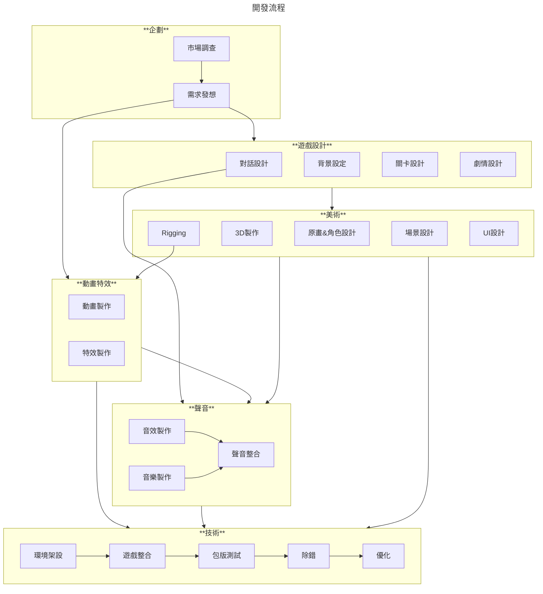

::: tip
想像一下，你的遊戲世界裡，風吹樹葉沙沙作響、子彈呼嘯而過、角色情緒透過聲音表達，這些都是 FMOD 可以做到的！FMOD 就像一位音訊魔法師，讓聲音在你的遊戲中活起來。
:::

## 什麽是 ==**聲音引擎?**==

在遊戲開發中，聲音引擎是一個專門用於處理遊戲中音訊的軟體系統。

它的主要功能包括：
- [x] 播放各種音效和背景音樂。
- [x] 管理聲音的空間定位，模擬聲音的遠近、方向等。
- [x] 實現聲音的動態變化，例如根據遊戲事件調整音量、音調等。
- [x] 優化音訊播放，提高遊戲效能。
- [x] 知名的遊戲聲音引擎包括 FMOD 和 Wwise等。

## **為什麽要使用聲音引擎？**

很多讀者覺得好奇，常見的遊戲引擎內已經整合了聲音播放的功能，也自帶了非常多的效果和插件，為什麽還需要另外安裝一個聲音引擎作為輔助呢？

我們可以從遊戲開發的過程來側面描述這個問題。

:::: steps
1.  **概念發想與企劃階段**

    遊戲概念確立：
    確定遊戲類型、主題、目標受眾。
    構思遊戲的核心玩法和獨特之處。

2. **美術設計**

    設計遊戲角色、場景、介面等視覺元素。製作遊戲的概念藝術和模型。

3. **場景設計**

    會製作遊戲中使用到的場景，通常包括2D平面場景或3D場景。

4. **聲音設計**
  
    > 替專案製作音樂，設計專案專案中會使用到的音效，確保聲音播放正確與完美。

5. **程式整合**

   程式將上述所有美術資源和企劃文件協同處理後，一起整合進專案，進行最後打包和輸出的工作。
::::

通常程式的撰寫會在專案初期就架設好開發環境，接下來會交由美術和場景人員進行視覺素材的開發和製作。
然而，多數的時候這兩個項目是同時並進的。

---
### **永遠不夠的開發時程**

> 聲音的製作往往是所有專案開發裏面的靠後的一個環節，如果在專案開發時程不長的情況下，非常容易被壓縮。

身為遊戲相關從業人員都知道：時程過於緊湊，很有可能導致專案品質!!大爆死xD!!。

正因為聲音製作的環節往往受制於美術素材和背景設定，一旦壓縮了工作時間，
不僅會讓聲音在製作過程中品質大打折扣，專案中有很多聽覺表現將會收到大幅度的影響。

:::tip 所以...該怎麽辦？
*儘可能的縮短聲音素材進入專案到播放出來的時間。*

在時程非常緊湊且不足的情況下，技術人員勢必得==刪減美術部分的整合工作=={.caution}，進而導致
 **聲音設計師** 製作完的素材很有可能無法接入遊戲內，無法達到心目中想要的表現效果。
:::

### **溝通出現很大的問題**

作為一個優秀的聲音製作人員，清楚==企劃要什麽==是極為重要的。
通常在企劃前期階段，聲音製作人就需要和遊戲設計人員盡早開始溝通，瞭解開發的專案整體的美術風格、劇情走向和競品參考，會對接下來的製作訂下更明確的方向。

:::: card-grid
::: card title="與企劃" icon="twemoji:artist-light-skin-tone"
在專案的初期，無論是背景故事、作品受眾和開發動機，都是對接下來的開發工作極為重要的部分，因此除了要瞭解以上幾個項目，可以明確和企劃或遊戲設計部門提出以下問題：
- What 這個作品需要什麽內容？
- Who 這個作品需要給誰觀看？
- When 作品的開發週期有多長？
- where 作品可能會放在什麽平臺？
- Why 這個作品的開發動機是什麽？
:::

::: card title="與技術" icon="twemoji:technologist"
在專案執行的後期，聲音需要和技術做大量的對接與整合的工作，所以知道如何讓技術知道“如何”播放我們設計出來的聲音，便是首要的任務。
- Where 這些聲音需要播放在哪裏？
- When 這些聲音需要何時被播放？
- How 如何正確呈現聲音的播放效果？
:::
::::

:::note 為何常常做出來跟預期總是不太符合？
> 需求越明確，誤會也越少！

很大的原因會在於 **企劃方面** 是否給出了明確的風格參考和專案開發方向。
若是無法在需求的說明上給出完整的規劃，很容易在後期得到不服預期的結果。

:::

