::: note 簡介
想像一下，你的遊戲世界裡，風吹樹葉沙沙作響、子彈呼嘯而過、角色情緒透過聲音表達，這些都是 FMOD 可以做到的！FMOD 就像一位音訊魔法師，讓聲音在你的遊戲中活起來。
:::

## 什麽是 ==**聲音引擎?**==

在遊戲開發中，聲音引擎是一個專門用於處理遊戲中音訊的軟體系統。

它的主要功能包括：
- [x] 播放各種音效和背景音樂。
- [x] 管理聲音的空間定位，模擬聲音的遠近、方向等。
- [x] 實現聲音的動態變化，例如根據遊戲事件調整音量、音調等。
- [x] 優化音訊播放，提高遊戲效能。
- [x] 知名的遊戲聲音引擎包括 FMOD 和 Wwise等。

## **為什麽要有聲音引擎？**

很多讀者覺得好奇，常見的遊戲引擎內已經整合了聲音播放的功能，也自帶了非常多的效果和插件，為什麽還需要另外安裝一個聲音引擎作為輔助呢？
那我們先來看看具體可以用聲音引擎做什麽：

::::card-grid
::: card title="單純使用內建引擎" icon="twemoji:video-game"
 - [x] 播放聲音事件
 - [x] 調控聲音音量
 - [x] 自行撰寫邏輯代碼播放複雜事件
:::
::: card title="加入聲音引擎的協助" icon="twemoji:wrench"
 - [x] 包含原本內建所有的播放功能
 - [x] 可視化聲音管理界面
 - [x] 優良的聲學設計系統
 - [x] 無需透過代碼即可設計有邏輯的事件
 - [x] 透過API調用底層代碼實現特定邏輯
 - [x] 完整的聲音播放性能監視
:::
::::

簡單來說，聲音引擎（FMOD、Wwise、Criware）等都是為了減輕聲音工作者的負擔而生的一種工具，透過簡單的容器來代替複雜的底層代碼，實現輕鬆的聲音交互功能。

## **不使用會怎麽樣嗎？**

好問題，引擎的使用與否對整體的流程有什麽影響嗎？

當然有。

影響多大取決於你對待專案開發的用心程度，如果只是要速速開發一款實驗性的產品，使用與否就無關緊要了。
如果您是要準備製作一款需要長期維護，並能打造一個跨部門溝通協調的角色，相信我你不會想要錯過使用這些工具。

我們可以從下面的狀況來瞭解，在這些工具介入之前常常會遇到的問題：

### **1 - 時程**

> 聲音的製作往往是所有專案開發裏面的靠後的一個環節，如果在專案開發時程不長的情況下，非常容易被壓縮。

如果說整個專案製作過程像是一道料理的話，那聲音的部分，就像是替已經料理好的菜色加上一點調味和風格。
但你是在戈登拉姆齊的餐廳的話，有可能會來不及調味就被迫上桌囉。（哭

```mermaid
---
title: 開發流程
---
flowchart TB

    需求發想 --> **動畫特效**
    需求發想 --> **遊戲設計**
    對話設計 --> **聲音**
    
    subgraph **企劃**
    市場調查 --> 需求發想 
    end
    subgraph **美術**
    原畫&角色設計
    3D製作
    Rigging
    場景設計
    UI設計
    end
    subgraph **遊戲設計**
    背景設定
    關卡設計
    劇情設計
    對話設計
    end
    subgraph **動畫特效**
    動畫製作
    特效製作
    end
    subgraph **聲音**
    音效製作 --> 聲音整合
    音樂製作 --> 聲音整合
    對話製作 --> 聲音整合
    end
    
    subgraph **技術**
    環境架設 --> 遊戲整合
    遊戲整合 --> 包版測試
    包版測試 --> 除錯 --> 優化
    end
    Rigging --> **動畫特效**
    **遊戲設計** --> **美術**
    **動畫特效** --> **聲音**
    **動畫特效** --> **技術**
    **美術** --> **聲音**
    **聲音** --> **技術**
    **美術** --> **技術**

```


假設我們用3個月來開發一款專案，而聲音設計可以開始動工的時間往往已是最後一個月了。
除了部分素材和語音可以提前先準備，大部分的元素還是得等前面美術視覺設定完成後才能開始動工。

:::tip ***使用聲音引擎帶來的改變***

在時程非常緊湊且不足的情況下，技術人員勢必得==優先完成美術整合工作=={.caution}，進而導致
 **聲音設計師** 製作完的素材很有可能無法接入遊戲內，無法達到心目中想要的表現效果。

 加入工具的協助後，聲音設計師可以快速的在專案中得到自己要的表現效果，有效改善時程被延宕等問題。
:::

### **2 - 模糊的需求**

作為一個優秀的聲音製作人員，清楚==企劃要什麽==是極為重要的。
通常在企劃前期階段，聲音製作人就需要和遊戲設計人員盡早開始溝通，瞭解開發的專案整體的美術風格、劇情走向和競品參考，會對接下來的製作訂下更明確的方向。

:::: card-grid
::: card title="與企劃溝通要點" icon="twemoji:artist-light-skin-tone"
在專案的初期，無論是背景故事、作品受眾和開發動機都是必要的訊息，因此除了要瞭解以上幾個項目，可以明確和企劃或遊戲設計部門提出以下問題：
- **What** 這個作品需要什麽內容？
- **Who** 這個作品需要給誰觀看？
- **When** 作品的開發週期有多長？
- **where** 作品可能會放在什麽平臺？
- **Why** 這個作品的開發動機是什麽？
:::

::: card title="與技術溝通要點" icon="twemoji:technologist"
在專案執行的後期，聲音需要和技術做大量的對接與整合的工作，所以知道如何讓技術知道“如何”播放我們設計出來的聲音，便是首要的任務。
- **How** 如何播放這些聲音？
- **When** 這些聲音需要何時被播放？
- **Where** 這些聲音需要播放在哪裏？
:::
::::

:::tip 兩者的區別？
**和遊戲設計、企劃溝通最重要的事找到 ==為什麽==**。

**和程式、技術溝通最重要的部分是知道 ==如何做==**。
:::

:::warning 為何常常做出來跟預期總是不太符合？
很大的原因會在於 **企劃方面** 是否給出了明確的風格參考和專案開發方向。
若是無法在需求的說明上給出完整的規劃，很容易在後期得到不服預期的結果。
:::

### **3 - 浪費太多時間在瑣事上**

有時候我們想要設計一些比較複雜的事件，
例如我們收到企劃方面要求如下:

:::note 設計需求
玩家在血量較低的時候，會出現心跳加快的聲音，並且伴隨喘氣聲，
同時背景音樂由舒緩轉變成緊張的氛圍。
:::

以上的事件單純透過內建的引擎，不僅實現上需要技術的協助，還要等到功能完成才有辦法進行測試。
等到測試完成，通常會耗費大量的時間在等待上。


```flow:vue
st=>inputoutput: 聲音素材製作
logic=>condition: 是否使用聲音引擎
event=>operation: 設計聲音事件
user1=>subroutine: 自行將素材放入專案
user2=>subroutine: 撰寫邏輯代碼
user3=>subroutine: 等待技術功能完成
user4=>subroutine: 自行測試
totech=>subroutine: 請技術協助串接事件
e=>end: 聲音正常表現
st->logic(yes)->event->totech->e
st->logic(no)->user1->user2->user3->user4(left)->totech->e

```

:::tip 自行撰寫代碼?
確實!

但作為聲音設計的一員，有許多聲音表現的功能往往需要複雜的代碼來協助實現，如果有一種工具可以減輕寫代碼的負擔和時間，何樂而不為呢?
:::

## **聲音引擎能幫到誰?**
說了這麽多，誰會用到這個東西？我們可以用不同的角色來看這件事情：

<Card title="✍企劃">
  遊戲開發中需要大量的關卡編寫和劇情設計，企劃可以透過這些模塊化的聲音事件、自由的編輯關卡中需要素材，得到最及時正確的表現效果。
</Card>
<Card title="🔉聲音設計師">
  透過聲音引擎的協助，聲音設計師可以大幅減少和技術溝通的成本，運用將遊戲或專案中的表現和創意再提升一個層次。
</Card>
<Card title="👨‍💻技術與程式">
  聲音引擎大幅度簡化了播放聲音的邏輯概念，技術不再需為複雜的播放邏輯重寫代碼，能更專注再優化和執行專案內容上。
</Card>

簡而言之，和聲音設計接觸到的部門都能從中受益，無論其本身是否直接和製作相關。聲音引擎精簡繁複的工作流，對聲音設計的人員來說更是如魚得水。

## **準備開始**

相信在閲讀以上內容後，應該都準備好開始我們的聲音之旅了！
你可以從下方鏈接跳轉到相關的課程：

<CardGrid>
  <LinkCard title="FMOD" href="/" />
  <LinkCard title="Wwise" href="/" />
  <LinkCard title="CriWare" href="/" />
  <LinkCard title="Godot" href="/" />
</CardGrid>
