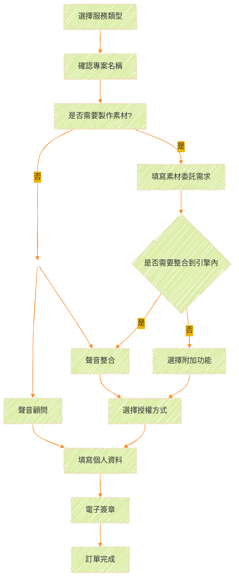

## **報價系統界面**

在首頁我們會分成六大區塊：
  - `Get Quote` （取得報價）
  - `Invoice & Contract` （發票 & 合約）
  - `Pay & Download` （付款 & 檔案下載）
  - `Documents` （文檔說明）
  - `Profile` （個人資訊）
  - `Contact` （聯繫我們）
  

為了方便客戶和使用者自行瞭解訂製聲音的成本費用，我們提供線上試算表單。
首先我們點擊左上角的 `Get Quote` 。

<ImageCard
  image="/Images/services/Choose-01.png"
/>

## **整體流程概覽**

下圖是服務整體流程的大概示意圖。

## **選擇服務類型**

您可以在這個畫面中選擇服務的類型，目前一共分為6種：

<ImageCard
  image="/Images/services/QuoteType.jpg"
/>

<CardGrid>
  <LinkCard title="Sound Design" href="/Service/vgyyszs8/" description="聲音設計"/>

  <LinkCard title="Music Production" href="/" description="音樂製作"/>

  <LinkCard title="Voice Recording" href="/" description="語音錄製"/>

  <LinkCard title="Game Integration" href="/" description="遊戲整合"/>

  <LinkCard title="Audio Consulting" href="/" description="專業顧問"/>

  <LinkCard title="Holistic Planning" href="/" description="專案統包"/>

</CardGrid>

## **Step1 - 確認專案名稱**
 
您可以在這個頁面確認您剛才的選擇，並決定好您的專案名稱。
<ImageCard
  image="/Images/services/Choose.jpg"
/>
你也可以在這個頁面同時選擇多個服務。
例如：同時選擇音效 + 整合。

<ImageCard
  image="/Images/services/MultiChoose.jpg"
/>

::: warning
如果您只要單純的素材製作，請不要多選"整合"。
:::

::: tip 指南
舉例：

如果您有17個音效、2首音樂需要委託，並且需要整合進專案內協助調整，請選擇 ==聲音設計=={.caution} + ==音樂製作=={.warning} + ==遊戲整合==。
:::

## **Step2 - 素材委託階段(主要)**

如果我們已經在 `報價界面` 選擇了委託類型，我們可以在這個階段填寫素材委託的細節和數量，詳細步驟請參考[**委託類型**](/Service/vgyyszs8/)。

::: important
此為聲音委託之**必要階段**，請先完成此部分再進行附加功能的選擇。
:::

## **Step3 - 選擇附加功能(附加)**

接下來我們進到第二部分 `選擇附加功能` ，您可以在這邊選擇是否要添加額外的功能。

<ImageCard
  image="/Images/services/Quote-Integration-0.png"
/>

### **無附加功能**

如果您的委託只需要單純的素材製作就好，請選擇此項目。

### **開立授權書**

如果您需要授權文件證明此委託之檔案為我方“聲岳設計”直接提供並保證使用之合法性，請勾選此項目。
Ex:部分場合如政府單位會需要審核您的素材或媒體檔案是否為合法來源，開立授權書能有效解決此問題。

### **延長保固時間**

我們所有委託製作的保固和修改時間為交付檔案後之兩週（14天內），如果您有需要延長此時間，可以在這邊做延長。

### **遊戲引擎整合**

此項目可以作為訂單委託之==獨立使用==項目或==附加使用==項目。

詳細的使用方式請參考 [**遊戲整合**](../2.開始使用/2.委託類型/4.遊戲整合.md) 欄目。

## **Step4 - 選擇授權方式**

因確保製作的原創性和保障性，我們提供的素材委託製作都有一定的授權費用。
針對不同的授權模式，請參考我們詳細的[授權說明](https://portal.soundjaeger.com/license-policy/)。

<ImageCard image="/Images/services/License Fee.png"/>

### **單一專案授權**  
委託的聲音只會用於單一專案。您==不可以=={.caution}將委託之檔案或素材用於該專案之外的內容。  

### **多專案授權**   
委託的聲音可以用於多個不同專案。您==可以=={.green}將委託之檔案或素材用於不限數量之專案內使用。 

### **買斷授權**  
您享有該委託聲音的所有權利。包括但不限於：  
✅ 著作財產權  
✅ 著作人格權   
✅ 永久使用權  
✅ 二次修改權

::: important
若您需要相關授權協議以書面方式提供，請聯繫我們，我們提供紙本或電子合約為雙方做保障。
:::
::: caution 
所有授權方式除了《買斷授權》以外，皆不得同時提供該素材於兩人以上使用。
:::

### **費用結算**

如果已經完成上述所有表格之內容，**藍色框**部分則是您 `委託素材` 的費用，而**緑色框**部分則是 `整合及附加功能` 的費用。
我們可以點擊下方的 **`Next`** 進到下一個頁面進行確認。

## **Step5 - 確認訂單內容**

在第二頁，我們可以檢查上一頁的內容是否有誤，如果發現有錯誤需要更正，請點擊 **`Previous`** 返回上一頁修改，如果沒有正確無誤請點擊 **`Next`** 到下一頁做個人資料填寫。
<ImageCard image="/Images/services/Check-Your-Quote.png"/>

## **Step6 - 填寫個人資料**

接下來您需要告知我們您的個人訊息，如果曾經填寫過可以從 `代入個人資料` 裏面選取，系統將自動代入您曾經填寫的資料。
<ImageCard image="/Images/services/Personal-Data.png"/>

::: important
如果您為個人或獨立工作室的身份，請選擇 **`個人`** ，若為公司組織或擁有統一編號請選擇 **`法人`** 。這將影響到發票和報價單的擡頭。  
:::

## **Step7 - 電子簽章**

這是最後一步了，為了確保訂單生效，您需要提供電子簽章作為報價訂單合法的唯一依據。
如果您尚未確認這份訂單是否正確，可以在這個步驟選擇《無》。等待您確認無誤之後再進行簽章。

### **無**
<ImageCard image="/Images/services/Sign-File-01.png"/>

如果您選擇此方式，訂單將會保留，並等待您簽回後才會生效。

### **手寫簽章**
<ImageCard image="/Images/services/Sign-File-02.png"/>

如果您是委託訂單的直接負責人，則可以透過手寫方式直接在屏幕上進行簽名，訂單將於提交簽名後生效。

### **上傳印章**
<ImageCard image="/Images/services/Sign-File-03.png"/>

如果您屬於法人且非直接窗口之負責人，也可以選擇此方式上傳貴司的印章圖檔。