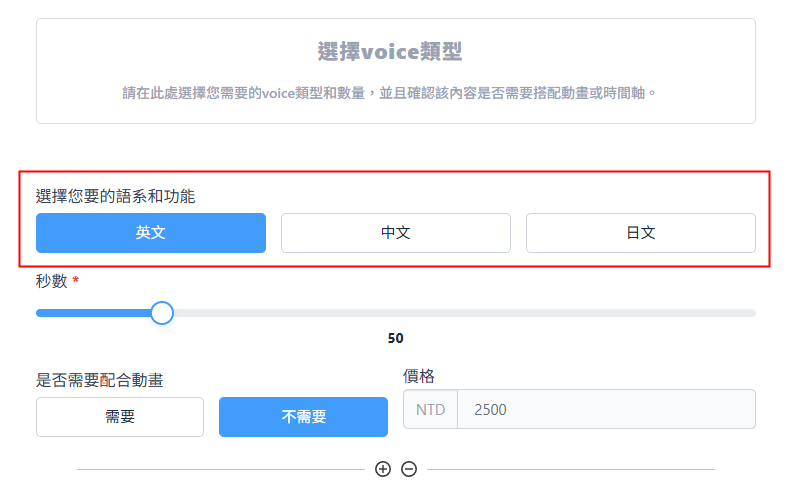
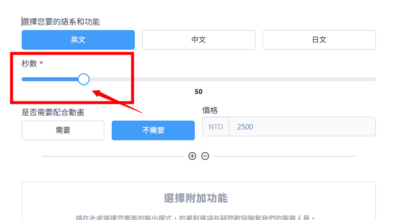
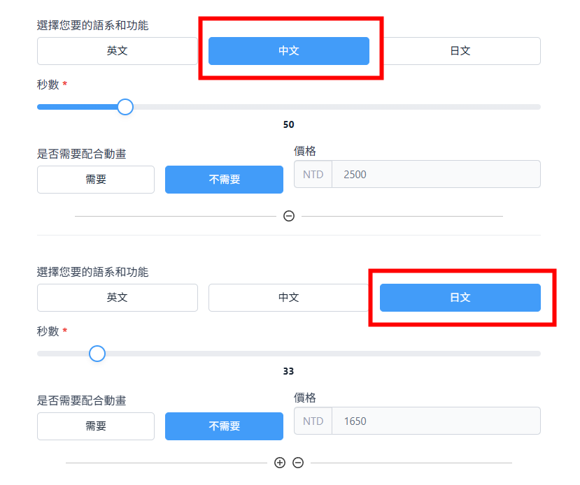

## **概述**  

::: important 介紹
**語音錄製** 是一項替專案中的角色或人物、生物或機器人等配音的服務，我們目前提供`人聲錄製`、`收音`、`AI生成`等項目。
:::

## **開始委託**
第一個步驟是先確定需要的語音是屬於什麽語言。
我們目前提供 `英文` 、 `中文` 和 `日文` 的錄音和生成服務。

::: steps

1. ### **選擇語系**  <Badge type="tip" text="Type" />

    你需要確認您所需要語言。

    

2. ### **選擇是否搭配動畫**
   
    根據您提供的影片或時間軸，我們可以依照需求調整語音生成或錄製的長度。

3. ### **填寫語音長度**

    填寫您語音的長度，算法為該語系的`總秒數`。

    

4. ### **添加多個語系需求**

    如果您有多個語言需要同時委託，請點擊下方的"+"號，可以新增一個語言區塊。
    

5. ### **價格試算**

    如果以上步驟皆完整無誤，您可以得到您該類型的音樂金額試算。

## 選擇附加功能

完成上方的環節後，我們可以進到下一步選擇其他附加功能：

[選擇附加功能](../1.取的報價.md#選擇附加功能)