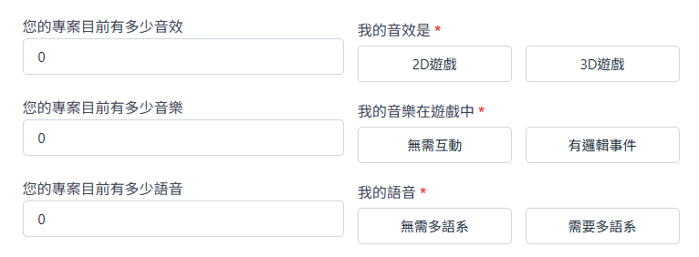

## **概述**  

::: important 介紹
**遊戲整合** 是將遊戲素材、媒體檔案透過聲音引擎整合進專案的服務，藉由第三方的軟體和插件來加速並簡化整體專案的開發流程。我們目前提供`FMOD整合`、`Wwise整合`等項目。
:::

## **開始委託**

::: steps
1. ### **聲音引擎** 
    
    目前提供4種整合的方式
    - `FMOD` (需另外安裝插件)
    - `Wwise` (需另外安裝插件)
    - `Unity`
    - `Unreal`

    您需要告知我們您目前遊戲中使用的聲音引擎為何。
    如果尚未使用過也歡迎和我們進一步討論合適的方案。

2. ### **首次使用**
  
    如果您是第一次使用這個服務，之前並無搭建過任何相關的聲音引擎系統，請選擇 **`是`** ，我們會在首次收取基本的設置費。
    
    如果之前已有使用過本服務，或是已經安裝了基本的聲音引擎整合軟件並且正在使用中，請選擇 **`否`** 。

3. ### **專案規模**

    請您告知我們您專案的開發規模為何，我們針對不同的開發量體有不同的定價。 

    

    ::: important
    我們對上述的規模定義如下：

     `獨立遊戲` - 遊戲為獨立開發之遊戲（開發團隊人數 ≤ 3）  
     `商業單機遊戲` - 遊戲為平臺不限之單機遊戲（開發團隊人數 > 3）  
     `大型線上遊戲` - 多人線上手遊、端遊（開發團隊人數 > 50）
    :::

4. ### **您的專案素材數量**
   
    我們需要統計您本次專案中需要`整合`的音效、音樂、和語音等進入遊戲引擎並進行優化。
    

    **聲音屬性**

    請選擇您的遊戲專案是屬於 **`2D`** 還是 **`3D`**，這將對製作的流程產生影響。

    - `2D` - 專案為平面視角，聲音不需要`遠近`或`方位`等屬性設定。

    - `3D` - 專案為第一、第三人稱之立體遊戲，需要可辨識的聲音屬性。
      
    **音樂屬性**

    - `無需互動` - 音樂不含任何邏輯與觸發事件。

    - `有邏輯事件` - 音樂需要配合場景或橋段做不同程度的樂段變化、擁有特定的播放方式。

    **語音屬性**
    
    請在此欄位確認您的專案是否需要多語系的功能。

    :::warning 請注意
    請填寫需要`整合`的數量，而非`委託素材製作`的數量。

    如您在委託音效時一共有5個音效，2首音樂，而原本遊戲中已經有了21個音效和3首音樂以及10句語音，若希望全部聲音都整合進聲音引擎內的話，請填寫26個音效、5首音樂和10個語音。
    :::

## 選擇附加功能

完成上方的環節後，我們可以進到下一步選擇其他附加功能：

[選擇附加功能](../1.取的報價.md#選擇附加功能)