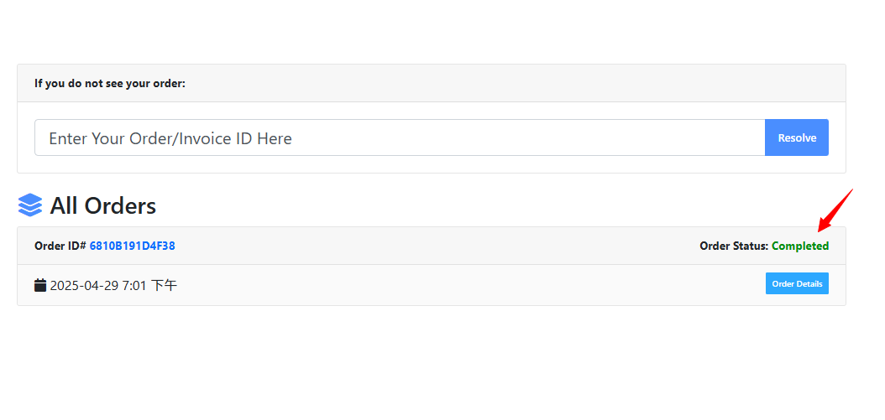

## **付款方式**

我們目前支援 
  - 信用卡刷卡
  - 信用卡分期
  - 線上轉帳
  - 超商繳費
  - Apple Pay

## **進入下載頁面**

在委託的檔案完成之後，我們該如何下載呢？首先，我們點擊頁面的右上方這個區塊：

  

點進頁面之後，可以看到屬於您的下載檔案清單，點擊Order Detail可以查看該下載檔案的詳細內容。

### **訂單未付款**

如果您的訂單已經製作完成，您將會在購買頁面看到訂單的狀態。

尚未付款的訂單會顯示 `Pending`。

此時的訂單您將無法看到下載按鈕，具體付款方式請參閲報價單上的訊息。

### **訂單已付款**

完成付款後，訂單狀態會顯示 `Completed`

頁面則會顯示綠色的Download按鈕，點擊即可下載您的委託檔案。

