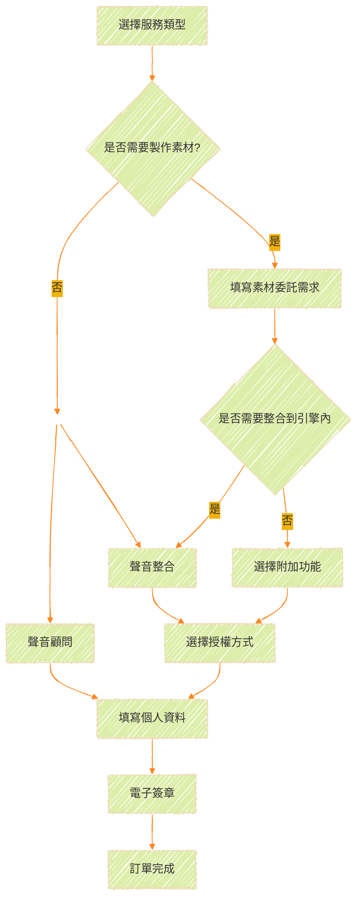

## **自助報價系統**

為了方便客戶和使用者自行瞭解訂製聲音的成本費用，我們提供線上試算表單。
首先我們點擊左上角的Get Quote。

<ImageCard
  image="/Images/services/Choose-01.png"
/>

## **整體流程概覽**

下圖是服務整體流程的大概示意圖。

## **選擇服務種類**

您可以在這個畫面中選擇服務的類型，目前一共分為6種：

<ImageCard
  image="/Images/services/QuoteType.jpg"
/>

<CardGrid>
  <LinkCard title="Sound Design" href="/" description="聲音設計"/>

  <LinkCard title="Music Production" href="/" description="音樂製作"/>

  <LinkCard title="Voice Recording" href="/" description="語音録製"/>

  <LinkCard title="Game Integration" href="/" description="遊戲整合"/>

  <LinkCard title="Audio Consulting" href="/" description="專業顧問"/>

  <LinkCard title="Holistic Planning" href="/" description="專案統包"/>

</CardGrid>

**聲音設計**  

> 為動畫、遊戲、影片客製化聲音表演，包含環境物件、事件音、界面音、技能音，合成聲效等常見音效製作。

- 環境音效設計
- 特效音效設計
- 介面音效設計
- 客製化聲音設計方案
  
**音樂製作**  

> 創作原創音樂，適用遊戲背景、影片配樂，包含環境音樂、短音樂、編作曲，可以依照需求提供特定橋段配樂或主題曲設計。

- 配樂製作
- 主題曲製作
- 廣告音樂製作
- 遊戲音樂製作

**語音録製**  

> 提供專業配音或AI生成配音、與高規格錄音室合作。適用角色對白、系統提示或臨時語音需求，確保音質清晰自然。

- 專業錄音室
- 多語言配音員選擇
- 後製處理服務

**遊戲整合**  

> 將聲音設計和音樂製作整合到遊戲中，提供遊戲音訊設計、程式設計和測試等服務。

- 遊戲音訊設計
- 遊戲音訊程式設計
- 遊戲音訊測試
- 支援各種遊戲引擎與音訊中間件

**專業顧問**  

> 提供聲音設計指導或顧問服務、遊戲音效整合與專案管理等專業諮詢，提供品控檢測和改善建議、為您的作品層層把關。

- 客製化音訊解決方案
- 技術支援與培訓
- 場地音響規劃與建置

**專案統包**  

> 端到端音頻解決方案，涵蓋遊戲、影片、專題製作，依規模客製化流程與跨領域協作執行，讓您無需針對單一需求另尋窗口。

- 完整音訊流程規劃與管理
- 跨部門音訊溝通協調
- 全方位音訊解決方案

## **確認專案名稱**
 
您可以在這個頁面確認您剛才的選擇，並決定好您的專案名稱。
<ImageCard
  image="/Images/services/Choose.jpg"
/>
你也可以在這個頁面同時選擇多個服務。
例如：同時選擇音效+整合。

<ImageCard
  image="/Images/services/MultiChoose.jpg"
/>

::: warning
如果您只要單純的素材製作，請不要多選"整合"。
:::

::: tip 指南
舉例：

如果您有17個音效、2首音樂需要委託，並且需要整合進專案內協助調整，請選擇 ==聲音設計=={.caution} + ==音樂製作=={.warning} + ==遊戲整合==。
:::

## **確認委託需求**

如果已經確認好專案的名稱，我們接下來就可以開始針對需求的部分進行委託，在這邊我們用聲音設計作為範例：

<ImageCard
  image="/Images/services/Quote-SFX.png"
  title="選擇您需要的聲音類型"
  description="音效類型分成六大類型，詳細的類型說明請參考說明。"
/>

::: steps

1. **選擇聲音類型**

    你需要確認您的聲音類型[+sfxtype]是哪一個種類。
    [+sfxtype]:聲音類型目前分成==環境聲音==、==物件聲音==、==事件聲音==、==界面聲音==、==技能聲音==、==動畫聲音==。

2. **選擇是否搭配動畫**[+withAnimation]。

    [+withAnimation]:如果您的聲音不需要畫面就可以完成，則無需搭配動畫，例如：ak47的槍聲、刀叉碰撞的聲音、一個簡單的訊息提示聲等。
    如果需要搭配動畫請再未來製作時附上參考影片。

3. **填寫需求數量**

    填寫該聲音需要的數量，EX：如果您的腳步聲需要輪替多個檔案，可以在這邊填寫2~4。

4. **添加複數類型需求**

    如果您有多種類型的聲音需要同時委託，請點擊下方的"+"號，可以新增一個聲音選擇區塊。
    <ImageCard image="/Images/services/Quote-SFX-Add.png"/>

5. **價格試算**

    如果以上步驟皆完整無誤，這邊可以得到您該類型的音效金額試算。

## **選擇附加功能**

接下來我們進到第二部分《選擇附加功能》，您可以在這邊選擇是否要添加額外的功能。

<ImageCard
  image="/Images/services/Quote-Integration-0.png"
/>

### **無附加功能**

如果您的委託只需要單純的素材製作就好，請選擇此項目。

### **開立授權書**

如果您需要授權文件證明此委託之檔案為我方“聲岳設計”直接提供並保證使用之合法性，請勾選此項目。
Ex:部分場合如政府單位會需要審核您的素材或媒體檔案是否為合法來源，開立授權書能有效解決此問題。

### **延長保固時間**

我們所有委託製作的保固和修改時間為交付檔案後之兩週（14天內），如果您有需要延長此時間，可以在這邊做延長。

### **遊戲引擎整合**

此項目可以作為訂單委託之==獨立使用==項目或==附加使用==項目。

<ImageCard
  image="/Images/services/Quote-Integration-1.png"
/>

此頁面的上面三個區塊分別是：

::: steps
1. **選擇您當前使用的聲音引擎**
   
    目前提供4種整合的方式
    - FMOD
    - Wwise
    - Unity
    - Unreal
    
    您需要告知我們您目前遊戲中使用的聲音引擎為何。
    如果尚未使用過也歡迎和我們進一步討論合適的方案。

2. **是否為首次使用聲音整合服務**
  
    如果您是第一次使用這個服務，之前並無搭建過任何相關的聲音引擎系統，請選擇《是》，我們會在首次收取基本的設置費。
    
    如果之前已有使用過本服務，或是已經安裝了基本的聲音引擎整合軟件並且正在使用中，請選擇《否》。

3. **您的專案規模**

    請您告知我們您專案的開發規模為何，我們針對不同的開發量體有不同的定價。  
    若您為學生或是獨立開發者，請選擇《小型獨立遊戲》。  
    若您為常規的遊戲開發公司或工作室，請選擇《非獨立製作之遊戲》。  
    若您為開發3A形遊戲、線上遊戲之工作室或遊戲公司，請選擇《3A規模單機或線上遊戲》

4. **您的專案素材數量**
   
   請注意，這邊的數量和您委託的製作數量==並無直接關係=={.warning}，請填寫您需要整合進目前遊戲中的正確數量。
    <ImageCard image="/Images/services/Quote-Integration-2.png"/>
    
    
    《**音效屬性**》  
    填寫完素材數量後，請記得替右邊的屬性完成設定。
    請選擇您的遊戲專案是屬於《2D》還是《3D》，這將對製作的流程產生影響。  
    《**音樂屬性**》  
    而如果您需要製作"含有邏輯"的音樂事件，請選擇相對應的選項。  
    《**語音屬性**》  
    請在此欄位確認您的專案是否需要多語系的功能。
    ::: warning
    如您在委託音效時一共有5個音效，2首音樂，而原本遊戲中已經有了21個音效和3首音樂以及10句語音，若希望全部聲音都整合進聲音引擎內的話，請填寫26個音效、5首音樂和10個語音。
    :::

5. **整合價格估算**

    下方的價格會顯示"整合"部分的費用（此階段和委託製作的部分的費用無關）。
:::

::: tip
在選擇服務種類的時候，如果您是選擇《==Game Integration 遊戲整合=={.warning}》，則此區塊將單獨出現，也可以透過在《選擇附加功能》的選項中單獨叫出。
:::

## **選擇授權方式**

因確保製作的原創性和保障性，我們提供的素材委託製作都有一定的授權費用。
針對不同的授權模式，請參考我們詳細的[授權說明](https://portal.soundjaeger.com/license-policy/)。

<ImageCard image="/Images/services/License Fee.png"/>

### **單一專案授權**  
委託的聲音只會用於單一專案。您==不可以=={.caution}將委託之檔案或素材用於該專案之外的內容。  

### **多專案授權**   
委託的聲音可以用於多個不同專案。您==可以=={.green}將委託之檔案或素材用於不限數量之專案內使用。 

### **買斷授權**  
您享有該委託聲音的所有權利。包括但不限於：
✅ 著作財產權
✅ 著作人格權    
✅ 永久使用權
✅ 二次修改權

::: important
若您需要相關授權協議以書面方式提供，請聯繫我們，我們提供紙本或電子合約為雙方做保障。
:::
::: caution 
所有授權方式除了《買斷授權》以外，皆不得同時提供該素材於兩人以上使用。
:::

### **費用結算**

如果已經完成上述所有表格之內容，**藍色框**部分則是您《委託素材》的費用，而**緑色框**部分則是《整合及附加功能》的費用。
我們可以點擊下方的《Next》進到下一個頁面進行確認。

## **確認訂單內容**

在第二頁，我們可以檢查上一頁的內容是否有誤，如果發現有錯誤需要更正，請點擊《Previous》返回上一頁修改，如果沒有正確無誤請點擊《Next》到下一頁做個人資料填寫。
<ImageCard image="/Images/services/Check-Your-Quote.png"/>

## **填寫個人資料**

接下來您需要告知我們您的個人訊息，如果曾經填寫過可以從《代入個人資料》裏面選取，系統將自動代入您曾經填寫的資料。
<ImageCard image="/Images/services/Personal-Data.png"/>

::: important
如果您為個人或獨立工作室的身份，請選擇《個人》，若為公司組織或擁有統一編號請選擇《法人》。這將影響到發票和報價單的擡頭。  
:::

## **電子簽章**

這是最後一步了，為了確保訂單生效，您需要提供電子簽章作為報價訂單合法的唯一依據。
如果您尚未確認這份訂單是否正確，可以在這個步驟選擇《無》。等待您確認無誤之後再進行簽章。

### **無**
<ImageCard image="/Images/services/Sign-File-01.png"/>

如果您選擇此方式，訂單將會保留，並等待您簽回後才會生效。

### **手寫簽章**
<ImageCard image="/Images/services/Sign-File-02.png"/>

如果您是委託訂單的直接負責人，則可以透過手寫方式直接在屏幕上進行簽名，訂單將於提交簽名後生效。

### **上傳印章**
<ImageCard image="/Images/services/Sign-File-03.png"/>

如果您屬於法人且非直接窗口之負責人，也可以選擇此方式上傳貴司的印章圖檔。