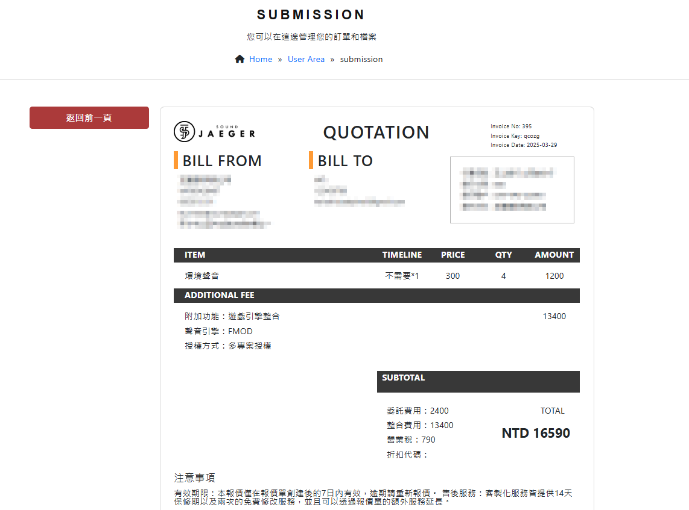
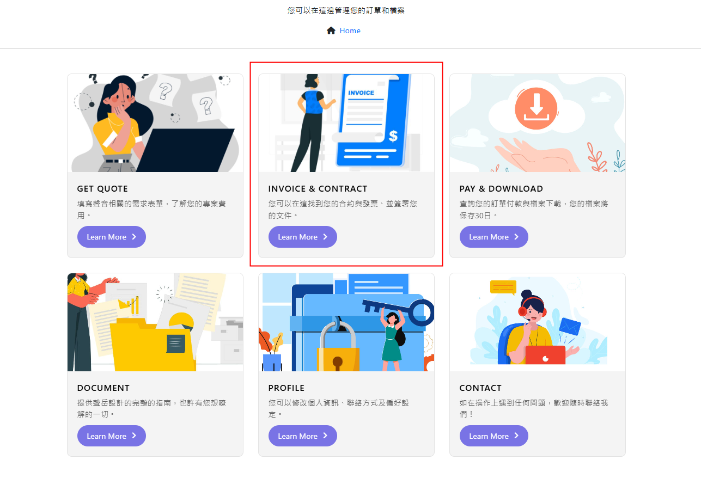
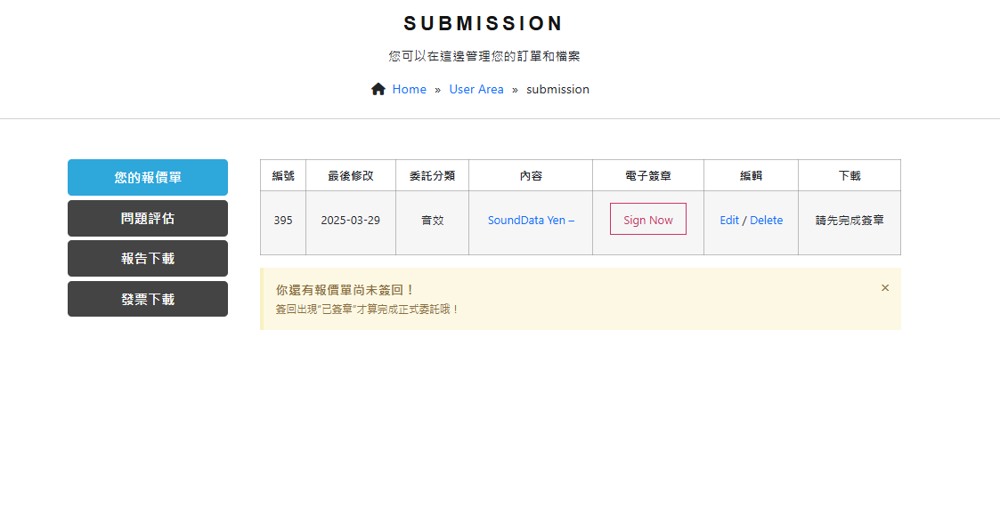
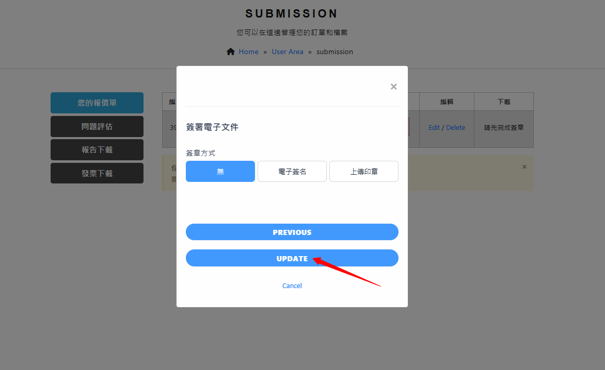
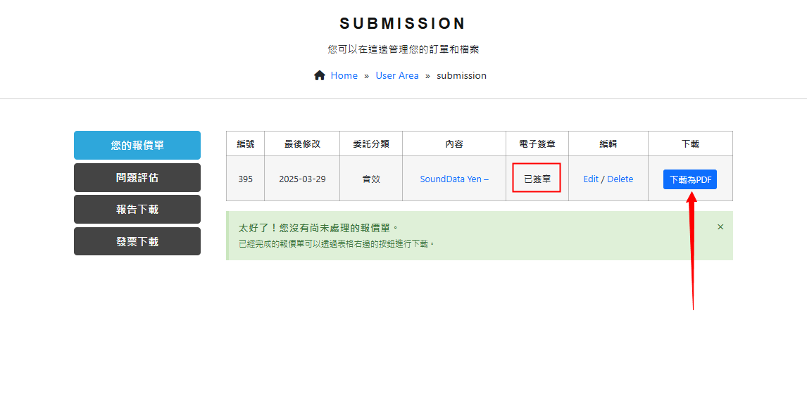

## **查詢訂單**

在完成訂單的同時，網站會自動跳轉到報價單的頁面，您可以在此查看剛才的資料是否正確。

---
您也可以從首頁的這個位置進入來查詢：

點進來後可以在《您的報價單》區域找到剛才填寫的內容。

### **未簽章**

此時報價單還屬於未簽回的狀態，您需要盡速確認內容是否正確，並且提供電子簽章或印章。
點擊清單上的《Sign Now》會跳出下方視窗，更新完簽名點擊《Update》即可。

### **已簽章**

如果您的報價單已經簽章完成，則清單上的內容會顯示"**已簽章**"，並且可以下載PDF格式作為留存。

## **編輯/刪除訂單**

您如果不想要這筆委託了，無論簽名與否，都可以點擊**編輯欄位**內的"Edit/Delete"進行修改或刪除。
